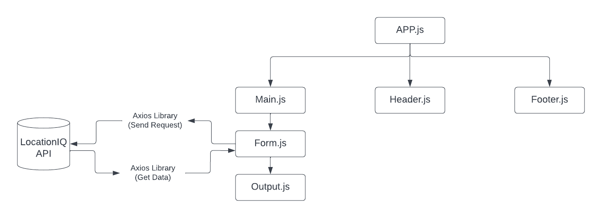

# City Explore

Deployed Site : [City Explore](https://cute-queijadas-fd176c.netlify.app/)

**Author :** Yazan Alfarra  
**Version :** 1.0.0

## Overview

When visiting a new place you need to get coordinates for the place you want to visit. This web application enables you to do so, it is user friendly and easy to use. You just enter a city name and it will renders the coordinates for that city along side of  a map to fully visualize the area.

## Getting Started

To build such web app follow the following steps:

1. Create a new React App.
2. Install axios library.
3. Install Bootstrap library.
4. Make a LocationIQ account to get access to the API.
5. Structure your components.
6. Fetch the data from the form and pass it to the API.
7. Get back the data from the API.
8. Clean up the data.
9. Render it.
10. Style your web application.

## Architecture

- This Web Application is built on React and Bootstrap for the sake of the front-end design along side CSS.
- Axios library was used to ease the process of making a GET request.
- LocationIQ API was used to get the coordinates based on a user input.
- Netlify was used to deploy the final product.

## Changing Log

28-08-2022 7:30pm - Application now is capable of sending a GET request and display the results on screen on click.

## Methodology and Working Flow

## Credit and Collaborations

1. Shoutout to [Ihab Abbas](https://github.com/ihababbas) aka partner. We designed the working methodology and flow of data.
